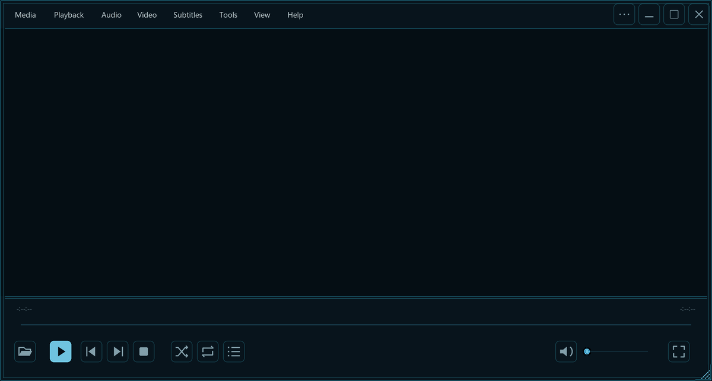

# TRONstyleStuff

TRON Legacy / Uprising customizations inspired by the ENCOM boardroom: black and blue-black surfaces, prominent neon blue/cyan outlines, soft-white titles, and smaller orange accents. Yellow is reserved for occasional emphasis.

This repository continues the history of `vlc-tokyo-night-skin` and brings the related projects together.

| Project | Contents |
| --- | --- |
| [VLC](vlc/) | TRON skin, installable bundles, build tools, Waves/Orbit visualizations, and playback checks |
| [Obsidian](obsidian/) | Tron Grid theme, manifest, and packaged release |
| [Codex desktop](codex/) | Theme imports and optional CSS divider launcher in `divider-test/` |
| [Bit animated companion](codex/bit/) | Exact rigid mesh, original atlas and validated replacement, reproducible builds and motion previews |
| [Pi coding agent](pi/) | Native TRON theme, cyan borders, blue/orange syntax roles, and profile-preserving installer |
| [Windows Terminal and Bash](terminal/) | ANSI palette, PowerShell input colors, Starship prompt, and minimal ble.sh configuration |
| [Zen Browser](zen/) | Browser chrome CSS, install/restore scripts, and preview screenshots |
| [Dark Reader](darkreader/) | General TRON web-content preset for Zen, CSS accents, and export-preserving import helper |
| [Wallpapers](wallpapers/) | Shanghai TRON wallpaper variants, accepted image, grading scripts, and previews |
| [ENCOM boardroom](https://github.com/ChromedomeV12/encom-boardroom) | Git submodule pointing to the existing fork, with its own history and upstream relationship |

## Previews

Future project notes: [eDEX-UI desktop utility, community forks, and tablet possibilities](research/edex-ui.md).

The full-resolution accepted wallpaper is [shanghai-tron-uprising.png](wallpapers/outputs/shanghai-tron-uprising.png).

## Working on the collection

Each project keeps its own build or installation instructions. Installing one does not install the others. Personal profiles, installation manifests, backups, browser data, and debug logs are excluded. Existing installations and original workspaces are separate from this source collection.

ENCOM remains maintained in its [separate fork](https://github.com/ChromedomeV12/encom-boardroom). This collection records a specific commit through the `encom-boardroom/` submodule. To include its checkout, clone with `git clone --recurse-submodules https://github.com/ChromedomeV12/TRONstyleStuff.git`, or run `git submodule update --init --recursive` in an existing clone. Make and publish ENCOM changes in its own repository, then update the submodule pointer here when appropriate.

The terminal roles are deliberate: commands and keywords blue; ordinary input and strings soft white; numbers/types orange; yellow used sparingly. Preserve the accepted Bash startup behavior and performance when adjusting colors.

See [PROVENANCE.md](PROVENANCE.md) for imported sources and licensing. Historical Tokyo Night VLC bundles are under `vlc/legacy-tokyo-night/`; current TRON releases are under `vlc/dist/`.
