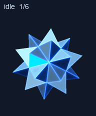
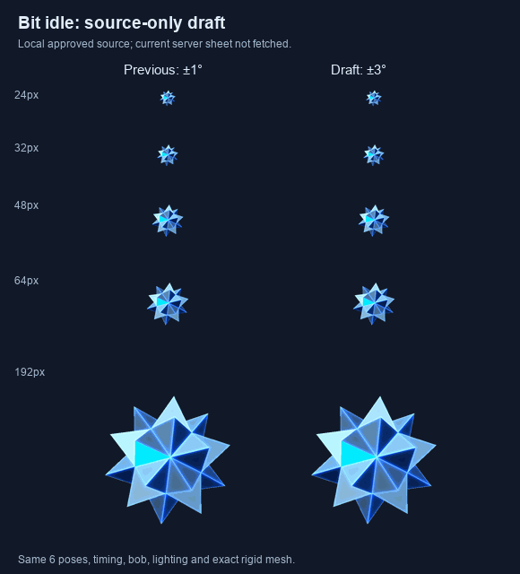

# Bit

A floating, faceted blue-white companion inspired by Bit from TRON, with no face or limbs. Its rigid mesh has 32 vertices, 60 equilateral triangles and 90 edges of length 2. One cyan-blue facet supplies an aiming cue.



## Versions and status

| Version | Contents | Status |
| --- | --- | --- |
| [Published snapshot](assets/published/) | Original full atlas and previews | Exact retained upload used for successful ChatGPT Work pet creation on 2026-10-02; preserved for comparison and recovery |
| [Approved idle source](assets/approved-idle-draft/) | Stronger idle source strip and comparisons | Approved on 2026-10-03; now incorporated into the replacement |
| [Validated replacement](assets/replacement/) | Full v2 atlas, nine state GIFs, all-state GIF/MP4, transition preview, contact sheet and stills | **Active in ChatGPT Work; not installed in Codex desktop** |

The replacement increases idle rotation from approximately ±1° to ±3°. Its six poses, 1.1-second timing, bob, lighting, palette, facet cue and mesh remain unchanged. One translation of the complete extracted idle row by one pixel to the left preserves the original neutral registration. All non-idle animation and look-direction rows are pixel-identical to the published atlas.



The stronger motion is easier to see at 32–64 px and remains subtle at 24 px. These are test cell sizes, not measured app dimensions. This changes amplitude, not FPS. See [deployment status](DEPLOYMENT.md) for the successful ChatGPT Work replacement and separate Codex desktop blocker.

## Reproduce locally

Tested with Python 3.14.6, NumPy 2.3.5 and Pillow 12.2.0. Rendering uses a 576×624 supersampled buffer. These tools contain no pet API calls and do not install, delete or activate pets.

```sh
python -m pip install -r requirements.txt
python tools/render.py idle --output build/previous --idle-profile published
python tools/render.py idle --output build/draft --idle-profile approved-draft
```

The renderer loads [assets/mesh.npz](assets/mesh.npz) with `allow_pickle=False`, checks its SHA-256 and enforces equal edge lengths after each rigid transformation. It never reconstructs or deforms the mesh. The geometry is a stellated icosahedral construction with a regular tetrahedral cap on each base face; this is a Bit-inspired design, not a claim about the film model's topology. The user explicitly requested this procedural technique under the pet contract's manual-technique exception.

Offline atlas reproduction uses the installed **work-pets 0.1.6 create-pet scripts**, supplied explicitly. Those external tools are not vendored. This is separate from the desktop `hatch-pet` installation workflow and its runtime requirements.

```sh
python tools/compare_idle.py --pet-tools /path/to/create-pet/scripts
python tools/verify.py --pet-tools /path/to/create-pet/scripts
python tools/rebuild.py --pet-tools /path/to/create-pet/scripts --variant published
python tools/rebuild.py --pet-tools /path/to/create-pet/scripts --variant replacement
```

Use a fresh `--output` directory for repeated builds. `rebuild.py` renders standard rows and look sources, runs bundled extraction, registration, assembly and one chroma cleanup pass, and requires the exact retained encoded hash. The replacement build also checks the approved idle source hash and every non-idle pixel. Outputs stay under ignored `build/` by default. `verify.py` checks both retained atlases, source parity, mesh geometry, idle timing, neutral registration and bundled structural/quality gates. New checks do not overwrite historical reports.

`compare_idle.py` reproduces the source comparison; portable default caption fonts may differ from retained labels. The atlas is transparent; navy is only a preview background.

## Validation and limits

Both atlases use the 1536×2288 v2 grid: 192×208 cells, nine animation rows, sixteen look directions, 73 occupied cells and 15 transparent unused cells. Both passed bundled structural and quality checks. The replacement also passed native Pets sprite-sheet preflight; this read-only check did not create an upload session or install a desktop pet.

| Atlas | SHA-256 |
| --- | --- |
| Original published | `f429c9ea76cc8e6cd84e1dcdff65cbaa67731def9232e6dcf626e384f6793870` |
| Validated replacement | `3eeea19ed7f822b7b77e48149f2fcf6613ce0e5711d8d3a38ba5ed973cafd862` |

[Reports](reports/) preserve actual results with local paths normalized. The replacement reuses historical independent look reviews only because every look pixel is identical; it does not claim three new blind reviews. Two of three original reviewers correctly classified all cardinals; the third found them ambiguous. Four intermediate minor-axis readings remained ambiguous by majority and were accepted after labeled loop review. Exterior gaps between star points produce scanline warnings but no enclosed alpha holes. Minor 1–2 px state-registration differences and restrained abstract state meanings remain documented.

Every decoded standard-state and idle→jump→idle GIF frame was compared with the final encoded replacement atlas; maximum mean RGB quantization error was approximately 1.291. No native FPS or continuous-player performance guarantee is made. Repository publication is not deployment, and retained upload bytes are not evidence of current server-byte parity.
