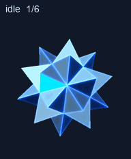

# Bit

A floating, faceted blue-white companion inspired by Bit from TRON. The solid has no face or limbs. It uses an exact rigid mesh: 32 vertices, 60 equilateral triangles and 90 edges of length 2. A cyan-blue facet supplies an aiming cue.



## Two distinct versions

| Version | Contents | Status |
| --- | --- | --- |
| [Published snapshot](assets/published/) | Transparent v2 atlas, base look, motion previews and contact sheet | Exact local bytes used in the successful pet creation on 2026-10-02 |
| [Approved idle draft](assets/approved-idle-draft/) | Stronger idle turn and mini-size comparisons | Approved on 2026-10-03; **not deployed** |

The draft changes the idle angular range from approximately ±1° to ±3°. Its six poses, 1.1-second timing, bob, lighting, palette, facet cue and mesh remain unchanged. At 32–64 px the facet changes are easier to see; at 24 px they remain subtle. These are test cell sizes, not measured app dimensions. This is an amplitude change, not an FPS upgrade.


The current server sheet could not be downloaded on 2026-10-03: its unexpired link returned HTTP 403. No alternate route, live update or selection change was attempted. The published files here are the retained upload snapshot; they do not prove current server-byte parity. See [deployment status](DEPLOYMENT.md).

## Reproduce locally

Tested with Python 3.14.6, NumPy 2.3.5 and Pillow 12.2.0. Rendering is sequential and uses a 576×624 supersampled working buffer. There are no cloud credentials or pet API calls in these tools.

```sh
python -m pip install -r requirements.txt
python tools/render.py idle --output build/previous --idle-profile published
python tools/render.py idle --output build/draft --idle-profile approved-draft
```

The authoritative mesh is [assets/mesh.npz](assets/mesh.npz). The renderer loads it with `allow_pickle=False`, checks its SHA-256 and enforces equal edge lengths after every rigid transformation. It never reconstructs or deforms the mesh. The asset is a stellated icosahedral construction with a regular tetrahedral cap on each base face; this is a Bit-inspired design, not a claim about the original film model's topology.

Atlas assembly and official validation require an installed **work-pets 0.1.6 create-pet `scripts` directory**. Those third-party tools are not vendored. Supply its location explicitly; no machine-specific location is assumed:

```sh
python tools/compare_idle.py --pet-tools /path/to/create-pet/scripts
python tools/verify.py --pet-tools /path/to/create-pet/scripts
python tools/rebuild.py --pet-tools /path/to/create-pet/scripts
```

`compare_idle.py` produces a source-only comparison and checks the previous frames against the retained raw idle strip. `verify.py` checks exact asset hashes, rigid geometry, both idle profiles, GIF timing and the bundled structural/quality gates. `rebuild.py` reconstructs the **published** atlas and requires an exact encoded-byte hash match. Its output stays under ignored `build/`; it does not deploy anything. Caption fonts in newly rendered comparisons use Pillow's portable default and may differ from the retained preview labels.

The published build uses the required 8×11 v2 grid of 192×208 cells: nine state rows plus sixteen directions, 73 occupied cells and 15 transparent cells. It preserves relative jump motion, corrects its shared extraction offset, registers both look rows at the same scale, and runs one chroma-edge cleanup pass. The stored atlas is transparent; navy is used only for preview backgrounds.

## Validation and limits

The retained published atlas passed the bundled structural and quality checks, native Pets preflight and strict-majority blind cardinal review. Its SHA-256 is `f429c9ea76cc8e6cd84e1dcdff65cbaa67731def9232e6dcf626e384f6793870`. [Reports](reports/) retain the actual judgments and reviewed warnings, with local paths normalized.

Two of three blind reviewers correctly classified all cardinals; the third found the directions ambiguous. Four intermediate minor-axis readings were ambiguous by majority and were accepted after labeled loop review. Exterior gaps between star points remain scanline warnings, with no enclosed alpha holes. Minor 1–2 px state registration differences and restrained abstract state meanings are documented. No native runtime FPS or continuous-player performance guarantee is made.

The draft has only source-level geometry, local-frame parity, timing and mini-preview checks. It has **not** completed a replacement-atlas or live-update workflow. The source was generated with the user's explicit procedural-method request under the pet contract's manual-technique exception.
