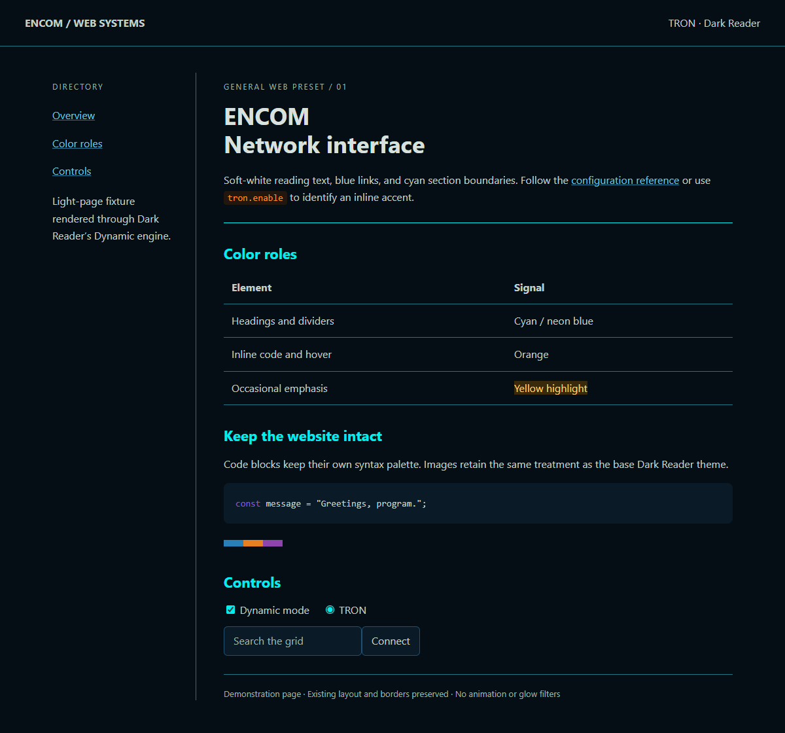

# TRON for Dark Reader

A general preset for the Dark Reader extension in Zen: blue-black surfaces, soft-white main titles, cyan section headings and existing dividers, blue links, orange inline code and hovered links, and occasional yellow highlights.

Use **Dynamic** mode. Dark Reader handles website background/text conversion; `TRON.css` adds semantic accents through **Dynamic Theme fixes**. The ordinary stylesheet editor belongs to Static mode and is not the right place for this overlay.

## Install

The files here are portable configuration sources. They do not automatically change your installed extension.

### 1. Base palette

Open Dark Reader → More → All settings → Advanced. Export your settings and keep that original file as your backup. From this directory, run the following with Python 3 (use `py` instead of `python` if that is your Windows launcher):

```powershell
python prepare.py settings "$HOME\Downloads\Dark-Reader-Settings.json" "$HOME\Downloads\TRON-Dark-Reader-Settings.json"
```

Import the generated `TRON-Dark-Reader-Settings.json` through Dark Reader's settings importer. **Do not import `TRON.theme.json` directly**: it is a patch, not a complete settings export.

The helper changes only the global theme fields listed in that patch. It preserves site lists, automation, fonts, per-site themes, and other settings. Existing per-site themes can therefore override the base palette. Dark Reader still needs to be enabled on the site you are viewing.

Alternatively set the global theme manually: Dark/Dynamic mode, background `#050E14`, text `#D8E1DD`, brightness/contrast 100%, grayscale/sepia 0%, selection `#183C66`, scrollbar `#287A9B` where those controls are available.

### 2. Cyan and orange accents

1. Open More → All settings → Advanced → **Dev tools**. Select **Dynamic Theme fixes**, using the full editor rather than the per-site editor.
2. Copy the **entire existing fixes text** into a UTF-8 file, for example `Downloads\Dark-Reader-Fixes.config`. Keep it as a separate backup: the settings export is not a substitute for this text.
3. Run:

```powershell
python prepare.py fixes "$HOME\Downloads\Dark-Reader-Fixes.config" "$HOME\Downloads\TRON-Dark-Reader-Fixes.config"
```

4. Paste the complete generated output back into the same editor and click **Apply**.

The helper inserts the CSS into the first global `*` block's existing `CSS` section. It preserves that block's other directives and all following site-specific blocks. Running it on a previously merged file replaces the marked TRON section rather than duplicating it. Original files are never overwritten; choose a fresh output name for another run.

For manual installation, insert `TRON.css` at the end of the existing global `CSS` section, **before the next directive** such as `IGNORE CSS URL` or the next `================================` separator. Do not replace the full fixes database with a small standalone wildcard rule.

## Scope and rollback

- This styles web content; the separate [Zen theme](../zen/) styles the browser chrome.
- The overlay is active only when Dark Reader applies its dark theme. Browser-internal pages, excluded sites, and pages skipped by dark-theme detection will not change.
- It recolors existing semantic borders without adding panel geometry. Custom web components, closed shadow roots, canvas contents, or unusual markup may need site-specific rules.
- The overlay avoids images, SVGs, animations, fonts, and code-block token colors. Dark Reader's underlying conversion still applies normally.
- Main titles stay soft white; smaller headings are cyan. Orange is more common than yellow through inline code and hover states. Actual frequency depends on each website's content.
- No extra extension, persistent helper, or polling script is required. The Python helper runs only when preparing an import.
- To undo, restore both your original settings export and your original fixes text, then Apply. Before rebuilding against newer Dark Reader fixes, start from a fresh copy of those fixes and merge again.

Keep personal exports outside this repository (or in the ignored `private/` directory).

## Alternatives

Dark Reader plus this overlay is the first choice for general light-to-dark conversion. [Stylus](https://github.com/openstyles/stylus/wiki/UserCSS) is useful if you later want separately toggled, site-specific accents or styling on native-dark sites that Dark Reader skips. It adds another extension and still needs site-specific adjustments; a universal aggressive stylesheet is more likely to break websites.

## Verification and references

Checked 2026-10-01 with Dark Reader 4.9.133's published API in headless Edge: colors, hover/focus, unchanged fixture geometry/code tokens/media, and inactive overlay in Light mode. The merger also preserved all 2,917 site-specific blocks in the upstream fixes database retrieved that day. The installed Zen extension has not been modified or visually tested.



`python -m unittest discover -s . -p "test_*.py"` checks that the merge preserves unrelated settings and fixes. `preview.html` is a light-page fixture; `verify.cjs` renders it with the published Dark Reader API and checks colors, layout, code tokens, and media before producing `preview.png`. This is engine/fixture validation, not a claim that every website or the installed Zen extension was tested.

Official references: [Dev tools and fixes syntax](https://github.com/darkreader/darkreader/blob/main/CONTRIBUTING.md), [theme dispatch](https://github.com/darkreader/darkreader/blob/main/src/background/extension.ts), [settings importer](https://github.com/darkreader/darkreader/blob/main/src/ui/options/advanced/import-settings.tsx).
