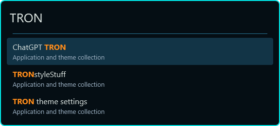

# TRON for Flow Launcher

Native XAML theme for Flow Launcher 2.1.4. The theme selector displays **TRON**.

Blue-black `#050E14` window, rounded cyan `#00EEEE` outline, blue separator and scrollbar, soft-white `#D8E1DD` search/result text, muted blue-gray subtitles, and orange `#FF8C1A` query matches and selected shortcut hints. Selected results use a blue `#123446` panel rather than a green success fill. Preview panels use the same palette. No blur, custom font, background image, or injection helper.

The layout follows the user's Tokyo Night theme, with existing font and row-size preferences retained by Flow. The outline keeps its 2px thickness, with slightly rounder 8px corners.

## Install

Run `Install.ps1` in PowerShell. It installs `%APPDATA%\FlowLauncher\Themes\TRON.xaml`, gracefully closes Flow, backs up the final saved settings, changes only the `Theme` JSON property, and reopens Flow in the background. It does not force-kill the launcher. Tokyo Night and the rest of your settings remain available.

Portable profiles can pass `-UserData` and `-FlowExe`. Backups live in the selected profile's `ThemeBackups/TRON-<timestamp>/` directory, outside this repository. Use Flow Settings → Theme → `tokyonight` to revert without rolling back unrelated preferences.

Manual install: copy `TRON.xaml` into your Flow user-data `Themes` folder and choose TRON in Settings → Theme. Restart Flow if it has not discovered the new file. Install into user data, not `app-<version>/Themes`, so app updates preserve it.

## Validation

Loaded the theme against the installed Flow 2.1.4 `Base.xaml` in a .NET 9 WPF harness and sealed all 29 resources/styles. The harness supplies the system accent brush normally provided by the app. The image below is a rendered WPF sample using these resources, not a screenshot of live search results.

Installed and activated on 2026-10-04. Flow exited through its normal close handler, restarted successfully without logged theme-load errors, and retained the TRON selection. Installed/source hashes matched. The post-start settings comparison differed only in `Theme` and Flow's own half-pixel rounding of `WindowTop` (259.5 to 260).

Reference: [Flow's theme format and installation documentation](https://github.com/Flow-Launcher/docs/blob/main/how-to-create-a-theme.md).
