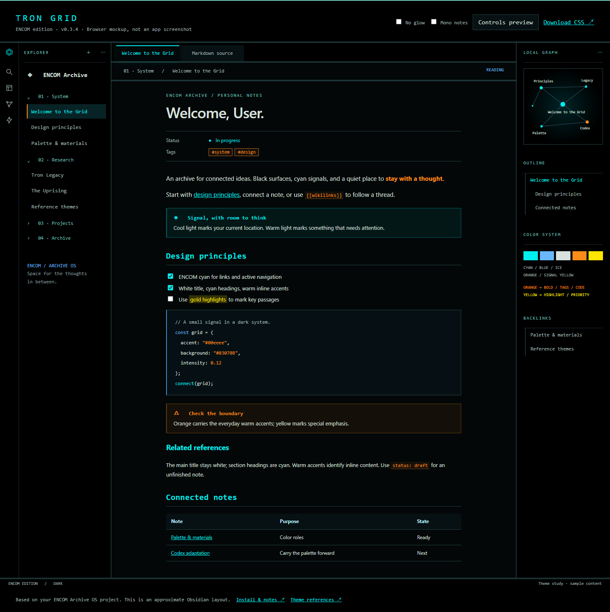

# Tron Grid · ENCOM edition · Obsidian theme

An original Tron: Legacy-inspired dark theme, grounded in your **ENCOM Archive OS** project. Version 0.3.4 keeps the main title white and section headings cyan and uses warmer accents for inline emphasis and small elements. This is an installable draft, not a published community theme.

The primary reference is `../encom-boardroom`: its `css/global.css`, `css/light-table-styles.css`, `css/boardroom-styles.css`, `css/blog.css`, and the reader styles in `js/blog-adapter.js`. The included light-table screenshot was also inspected. The reference project was read only; its code and animations were not changed.

## Install

1. Unzip `Tron-Grid-Obsidian.zip`.
2. In your vault, create `.obsidian/themes/Tron Grid/`. If your vault uses a custom configuration folder, use that folder instead of `.obsidian`.
3. Copy **manifest.json** and **theme.css** from the extracted `Tron Grid` folder into that directory. Avoid an extra nested `Tron Grid` folder.
4. Restart Obsidian, then open **Settings → Appearance**. Set **Base color scheme → Dark**, and select **Tron Grid** from the theme dropdown.
5. Copy `Sample note.md` into the vault to inspect headings, code, links, callouts, and tables in Reading view and Live Preview.

The folder name must match the manifest name exactly. This follows [Obsidian's theme installation/development structure](https://docs.obsidian.md/Themes/App+themes/Build+a+theme).

To revert, select your previous theme in Appearance. This package has no plugin code and makes no changes to notes or vault settings by itself.

## Design

| Role | Color | Use |
| --- | --- | --- |
| Black | `#000000` | Ribbon, sidebar, tabs; from ENCOM |
| Writing surface | `#030708` | Note background |
| Panel | `#071113` | Secondary surfaces |
| Ice | `#d8e1dd` | Body text |
| Cyan | `#00eeee` | Links, active navigation, focus; from ENCOM |
| Muted teal | `#6FC0BA` | Frame accents and folder labels; from ENCOM |
| Soft white | `#D8E1DD` | Note title and H1 |
| Cyan / pale cyan | `#00EEEE` / `#9AE8E8` | H2–H6 section headings |
| Neon blue | `#69B7FF` | Code keywords and external links |
| Vivid orange | `#FF8C1A` | Bold text, tags, strings, inline code, values, warnings, question callouts, graph tags, active file edge |
| Electric yellow | `#FFE600` | Explicit highlights, search matches, important callouts |

Tokyo Night informed the distinction between yellow and orange roles. Your preference takes priority over its heading scheme: the main title/H1 is white, H2/H3 are cyan, and H4–H6 are pale cyan. Version 0.3.4 makes vivid orange the dominant warm accent, following the user’s military-program/CLU distinction. Electric yellow is reserved for explicit highlights, search results, and important callouts. Tags and inline code use orange borders and tints. The title remains white and headings remain cyan.

Soft glow is limited to active tabs, framed dialogs, and primary buttons. Square corners, paired hairline dividers, and orange selection edges reference the ENCOM light table. Reading text has no glow, scanlines, grid overlay, or animation. Red and green remain available for errors and success states. The blue structural accent is retained from your requested direction.

Interface labels prefer Inconsolata, then Cascadia Mono or Consolas. Note text stays proportional by default, with an optional mono setting to echo the project's archive reader. Fonts are used only if installed; there are no network requests or required font downloads. The reference's Terminator display font and animated visualization assets are not bundled.

The theme uses Obsidian's CSS variables for most styling, with a few selectors for active edges and note details. It includes variables for Reading view, Live Preview, code, properties, navigation, modals, graph view, and Canvas. Third-party plugins that use native Obsidian variables should inherit many colors, but are not individually tested.

Light mode deliberately falls back to Obsidian's defaults. The declared minimum app version is a compatibility target, not a tested-version guarantee.

## Optional controls

If you already use the **Style Settings** community plugin, its **Tron Grid** section exposes **Disable neon glow**, **Monospaced notes**, and **Softer corners**. The theme works without that plugin. The **No glow** and **Mono notes** switches in `preview.html` only change the browser mockup.

For an always-quiet appearance without a plugin, change `--grid-glow` to `none` near the top of `theme.css`.

## What was checked

The browser mockup loads the same `theme.css` supplied for installation. It was rendered in Microsoft Edge at 1480px and 390px widths, visually inspected, and checked for horizontal page overflow. Reading/source switching, glow/mono-note toggles, modal opening, and Escape closing passed. The manifest parses and matches the folder name.

Thirty-six combinations of nine text/accent colors against four base surfaces meet 4.5:1 contrast; the lowest measured ratio is **5.72:1**. Nine rendered color roles were also checked, including a white title and cyan section headings, orange emphasis/tags/strings, and amber code/values. This is a palette check, not a full accessibility audit of Obsidian, plugins, composited highlights, or graph graphics.

**Not yet checked inside a running Obsidian instance.** The preview approximates the native layout; it does not run Obsidian, CodeMirror, Canvas, or its graph renderer. In particular, the graph in the mockup is illustrative. `VALIDATION.md` records the remaining native checks.

## Carrying this into Codex

`palette.json` preserves the same color roles for a later Codex adaptation. It is a design-token file, **not** a Codex import file.

The official [desktop Appearance documentation](https://learn.chatgpt.com/docs/reference/settings#appearance), reached from the Codex app settings documentation, describes base theme, accent, background, foreground, and font controls. A first manual mapping is:

- Base theme: **Dark**
- Accent: **#00eeee**
- Background: **#030708**
- Foreground: **#d8e1dd**
- UI font: **Segoe UI** (or the app's default)
- Code font: **Cascadia Code** if installed, otherwise **Consolas**

The exact import schema and appearance controls in this installed app have not been inspected. No Codex settings have been changed. Obsidian's CSS selectors and edge effects do not transfer through those color controls.

## Files

- `theme.css` and `manifest.json`: installable theme.
- `preview.html` and `preview.png`: interactive browser mockup and rendered image.
- `Sample note.md`: content to test inside your vault.
- `palette.json`: shared colors for future ports.
- `RESEARCH.md`: selected editor, IDE, and terminal references.
- `VALIDATION.md`: scope of checks and native QA checklist.
- `LICENSE`: license for this original implementation.

This is an unofficial fan-inspired theme. No film artwork, logos, or upstream theme code is included.
