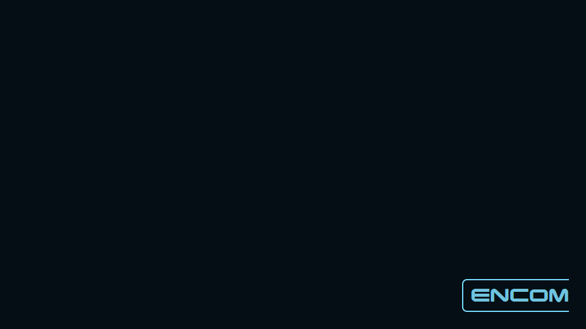

# ENCOM corner background



`encom-corner.png` is a 320 x 128 transparent PNG. The ENCOM mark has 28 pixels of right/bottom padding. Its blue lettering (`#6FC3DF`) and cyan frame (`#78DDFF`) come from the accepted terminal palette. Transparency leaves the terminal's existing `#050E14` background and window opacity intact. No gradients, animation, startup hooks, or remote-shell changes are involved.

The mark adapts the Terminator lettering and open, rounded frame from `encom-boardroom/css/light-table-styles.css` (`#lt-encom-logo`). It is a boardroom-style ENCOM treatment, not a newly sourced official logo. The font is read from that submodule without modifying or duplicating it. See the collection's provenance notes for the boardroom source.

## Windows Terminal setup

1. Copy `encom-corner.png` beside Windows Terminal's `settings.json` in its `LocalState` folder.
2. Merge the four fields in `settings.fragment.json` into `profiles.defaults`, or into one profile to limit the effect. Preserve the other settings.
3. Save. Windows Terminal normally picks up the settings change immediately.

```json
"backgroundImage": "ms-appdata:///Local/encom-corner.png",
"backgroundImageAlignment": "bottomRight",
"backgroundImageStretchMode": "none",
"backgroundImageOpacity": 0.55
```

These are image settings, separate from the profile's window `opacity`. An old `backgroundImageOpacity` such as `0.03` must be replaced or the logo will be nearly invisible. Profile-specific image settings override defaults. The logo remains local when running WSL, SSH, or Mosh.

This is the same fixed-size, bottom-right mechanism used by [Hackerman](https://github.com/rjcarneiro/windows-terminals/blob/master/themes/hackerman.md), documented in [Microsoft's background image settings](https://learn.microsoft.com/en-us/windows/terminal/customize-settings/profile-appearance#background-images-and-icons). `none` avoids stretching the logo when resizing the terminal. Windows Terminal paints terminal text over the image; it does not reserve that corner for the logo. Adjust image opacity if output overlaps it.

`encom-background-1920x1080.png` is the requested full-canvas alternative, with the exact opaque `#050E14` background. Prefer the transparent sticker for Terminal: a full wallpaper scales or crops its corner mark when the aspect ratio changes. `preview.png` shows the mark at full opacity on the same background; the recommended installed opacity is subtler.

## Rebuild

With the boardroom submodule checked out, Node.js, Playwright, and Microsoft Edge available:

```powershell
node build.cjs
```

The builder uses the existing code-native logo and Chromium font rendering, then exports PNGs. It reads current blue, cyan, and background colors from `../TRON-Legacy.json`.
